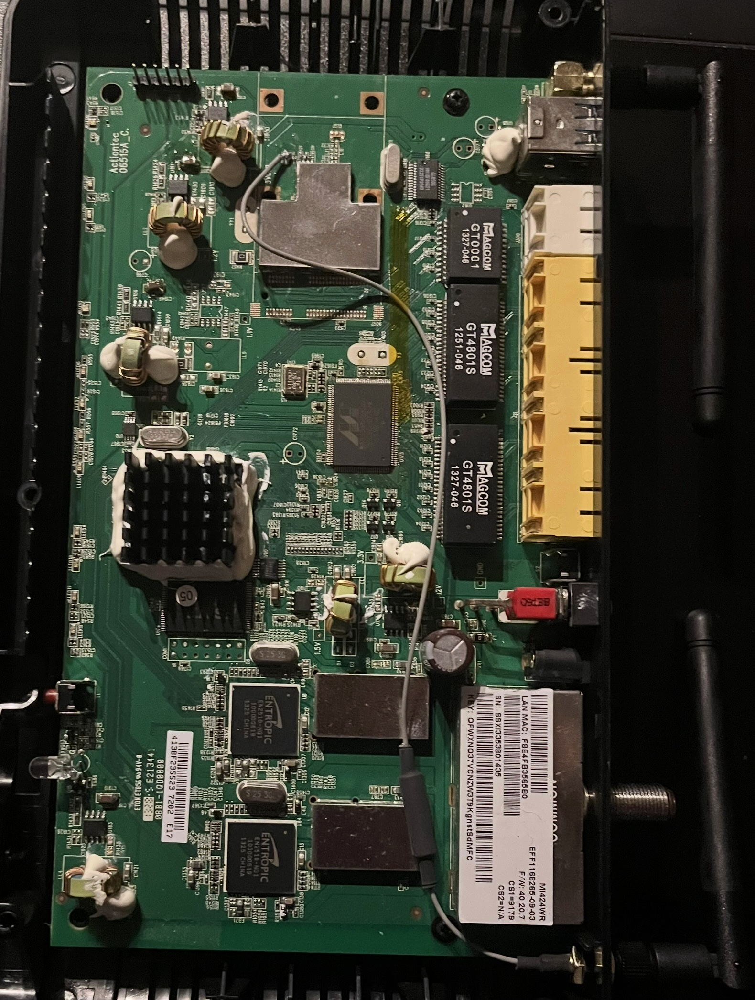

# MI424WR Revision 1 Router Vulnerability Analysis

## Introduction

This project was inspired by my interest for hardware hacking but my lack of electrical engineering knowledge. I have been seeing Electrical and Computer Engineering graduate programs, but I am unable to apply to them because I am not in an electrical engineering undergraduate program (I'm in computer science). I looked at the number of courses in an elecrical engineering degree and I saw that it would take a year or two, so I decided to start learning on my own. Topics like wireless communication, embedded systems, and control systems interest me, so I am going to explore all of them and how to perform vulnerability research on those systems.

The learning approach I took during this project was finding what I wanted to do, then finding how to do that and looking things up when I didn't understand. In this way, I was easily able to see how the base knowledge was useful to more complex topics (unlike school, where it often takes a while to realize the benefits of knowledge from previous courses).

## Disassembling the Router and Analyzing the PCB

After some initial learning about different circuit parts and serial communication protocols, I started looking for any old target I had laying around. This happened to be a router, but there are many other electronics that this process can be applied to.

I knew to look for the UART debugger first because I learned that it is often the easiest way to get a shell on the device and dump firmware. Lucklily, I could see a header through gaps in the router casing, which I suspected was UART.

This was confirmed when I opened up to see the PCB. There is a bunch of cool stuff here like transistors, inductors (those green circles with wire wrapped around them), and integrated circuits like an ethernet controller. The thing we are looking for is on the top left of the board - a header with 6 pins.

As you may know, there are only 3 pins required for a UART connection, but there are 6 here. There are no markings for the pins on this PCB, meaning the next step is figuring out if these pins are even for UART, and if they are, which 3 pins we need. This is possible by measuring voltage through the pins when the router is running. This can be done using a multimeter.
